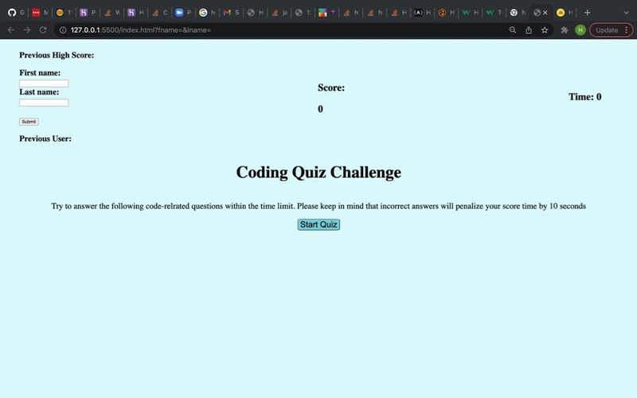
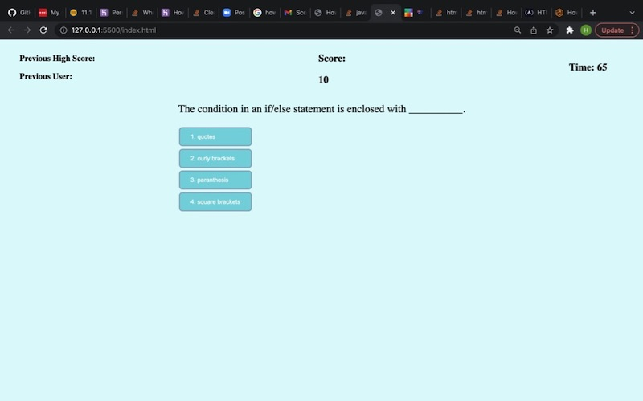
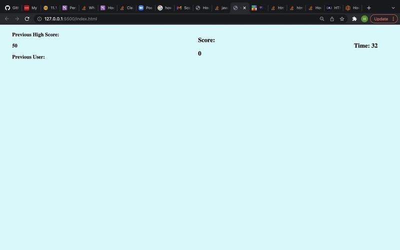

# coding-quiz-challenge

## About / Synopsis

- This project is a 5 questions coding quiz for bootcamp students!
- Project status: working/username in progress
- This project provides students with the opportunity to test their knowledge against other users by comparing their highscores against the last player.

See live site:

- <https://hestokes.github.io/coding-quiz-challenge/>

## Table of contents

> - [Title / Repository Name](#title--repository-name)
>   - [About / Synopsis](#about--synopsis)
>   - [Table of contents](#table-of-contents)
>   - [Screenshots](#screenshots)
>   - [Features](#features)
>   - [Resources](#resources)

### Screenshots

### Features

- Countdown Timer which allows 75 seconds.
- Wrong answer tracking with subtraction of 10 seconds per incorrect answer.
- Live tracking of user score as questions are answered.
- Live presentation of current high-score.

## Resources

- [Markdown Guidance ](https://doc.nuxeo.com/corg/readme-template/)
- [Javascript Score Tracking](https://michael-karen.medium.com/how-to-save-high-scores-in-local-storage-7860baca9d68)
- [Delightful Colors](https://flatuicolors.com/palette/au)
